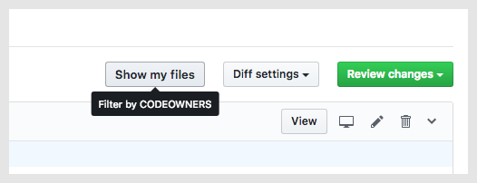

<h1 align="center">
  CODEOWNERS FILTER
</h1>

    

<h4 align="center">
  Chrome extension to filter PR files by <a href="https://help.github.com/articles/about-codeowners/">CODEOWNERS</a>
</h4>

  :sparkles: Works automagically with teams and private repos :sparkles:
   
  No personal access token needed!

  

 

<h6 align="center">
  Icon made by <a href="http://www.freepik.com" title="Freepik">Freepik</a> from <a href="https://www.flaticon.com/" title="Flaticon">www.flaticon.com</a> is licensed by <a href="http://creativecommons.org/licenses/by/3.0/" title="Creative Commons BY 3.0" target="_blank">CC 3.0 BY</a>
</h6>
